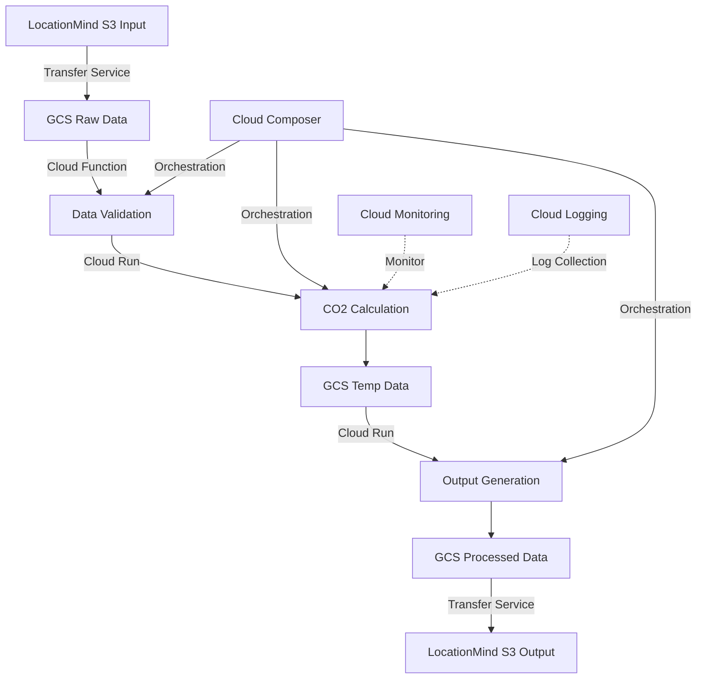

# lm-co2-server

CO2排出量計算システム

## システム概要

本システムは、LocationMind社から提供されたバッチデータに基づいて、Spatial Pleasure独自のアルゴリズムを用いてCO2排出量の推定を行い、その結果をバッチデータとして提供するシステムです。

### 主な特徴

- 日次バッチ処理による計算実行
- S3バケットを介したデータ連携
- 高セキュリティな単一接続ポイント
- 30分以内の処理完了目標

## データフロー

### データ連携の詳細フロー
1. データ取得フェーズ
   - LocationMind社のS3バケットから入力データを取得
   - 取得したデータの整合性チェック
   - 取得完了通知の記録

2. GCSへの転送フェーズ
   - Spatial Pleasure社のGCSへデータを転送
   - 転送データの検証
   - 転送完了ログの記録

3. 計算処理フェーズ
   - GCS上のデータを読み込み
   - CO2排出量計算処理の実行
   - 中間結果のGCSへの保存
   - 計算結果の検証

4. 出力データ生成フェーズ
   - 計算結果の整形
   - 出力用GCSバケットへの保存
   - 出力データの検証

5. S3への転送フェーズ
   - LocationMind社のS3バケットへ計算結果を転送
   - 転送完了確認
   - 処理完了通知の送信

### データストレージ構成
- **入力用S3バケット** (LocationMind社)
  - 権限: 読み取り専用
  - パス形式: `/input/YYYYMMDD/`

- **処理用GCSバケット** (Spatial Pleasure社)
  - 入力データ保存: `/raw/YYYYMMDD/`
  - 中間データ保存: `/temp/YYYYMMDD/`
  - 計算結果保存: `/processed/YYYYMMDD/`

- **出力用S3バケット** (LocationMind社)
  - 権限: 書き込み専用
  - パス形式: `/output/YYYYMMDD/`

### 入力データ要件

- **データ形式**: データベースダンプまたはParquet形式（スキーマ情報必須）
- **必要データ**:
  - LineString形式の軌跡データ
  - Geo属性データ（CSR、OSM由来等）
  - 車両情報（燃費、車種、使用年数）
  - タコメーターデータ

### ストレージ環境
- **入出力**: LocationMind社S3バケット
- **処理環境**: Spatial Pleasure社GCSバケット
- **データ転送**: セキュアな転送プロトコルを使用

### 出力データ

- 入力データのキーIDに紐付いた計算メトリクス
- クライアント指定フォーマットでの提供
- 拡張可能なメトリクス構造

## システム要件

### インフラストラクチャ
- Google Cloud Platform (GCP)環境での処理実行
- クラウドストレージ間のセキュアなデータ転送
- 適切なIAM権限管理

### パフォーマンス
- 処理頻度: 1日1回
- 処理時間目標: 30分以内
- 同時接続: 単一ノード

### セキュリティ
- S3バケットベースのセキュアな接続
- 個人情報非取扱い
- クライアントとの合意に基づくセキュリティ対策実装

### システム構成図

## 運用・保守

Spatial Pleasure社にて責任を持って対応

## 今後の展開

- 詳細要件の具体化
- パフォーマンス要件の最適化
- 将来的なリアルタイムAPI対応の検討（GraphQL等）

## 技術スタック

### GCPサービス構成

#### データストレージ・転送
- **Cloud Storage (GCS)**
  - 入力データ、中間データ、出力データの保存
  - バケット構成: `/raw`, `/temp`, `/processed`
- **Storage Transfer Service**
  - S3-GCS間の安全なデータ転送
  - スケジュール化された自動転送

#### 計算処理基盤
- **Cloud Functions**
  - データバリデーション
  - 転送完了通知
  - 軽量な前処理・後処理
- **Cloud Run**
  - CO2排出量計算の主処理エンジン
  - コンテナベースの実行環境
  - 自動スケーリング対応

#### ワークフロー管理
- **Cloud Composer (Apache Airflow)**
  - 日次バッチ処理のオーケストレーション
  - エラーハンドリングとリトライ制御
  - 処理フローの可視化

#### 監視・運用
- **Cloud Monitoring**
  - リアルタイムメトリクス監視
  - アラート設定
- **Cloud Logging**
  - 集中ログ管理
  - 監査ログ保存

#### セキュリティ
- **Cloud IAM**
  - アクセス制御・権限管理
- **Secret Manager**
  - 機密情報の安全な管理