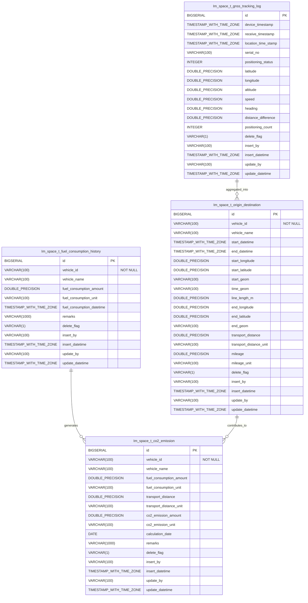

```mermaid
erDiagram
    Im_space_t_fuel_consumption_history {
        BIGSERIAL id PK
        VARCHAR(100) vehicle_id "NOT NULL"
        VARCHAR(100) vehicle_name
        DOUBLE_PRECISION fuel_consumption_amount
        VARCHAR(100) fuel_consumption_unit
        TIMESTAMP_WITH_TIME_ZONE fuel_consumption_datetime
        VARCHAR(1000) remarks
        VARCHAR(1) delete_flag
        VARCHAR(100) insert_by
        TIMESTAMP_WITH_TIME_ZONE insert_datetime
        VARCHAR(100) update_by
        TIMESTAMP_WITH_TIME_ZONE update_datetime
    }

    Im_space_t_gnss_tracking_log {
        BIGSERIAL id PK
        TIMESTAMP_WITH_TIME_ZONE device_timestamp
        TIMESTAMP_WITH_TIME_ZONE receive_timestamp
        TIMESTAMP_WITH_TIME_ZONE location_time_stamp
        VARCHAR(100) serial_no
        INTEGER positioning_status
        DOUBLE_PRECISION latitude
        DOUBLE_PRECISION longitude
        DOUBLE_PRECISION altitude
        DOUBLE_PRECISION speed
        DOUBLE_PRECISION heading
        DOUBLE_PRECISION distance_difference
        INTEGER positioning_count
        VARCHAR(1) delete_flag
        VARCHAR(100) insert_by
        TIMESTAMP_WITH_TIME_ZONE insert_datetime
        VARCHAR(100) update_by
        TIMESTAMP_WITH_TIME_ZONE update_datetime
    }

    Im_space_t_origin_destination {
        BIGSERIAL id PK
        VARCHAR(100) vehicle_id "NOT NULL"
        VARCHAR(100) vehicle_name
        TIMESTAMP_WITH_TIME_ZONE start_datetime
        TIMESTAMP_WITH_TIME_ZONE end_datetime
        DOUBLE_PRECISION start_longitude
        DOUBLE_PRECISION start_latitude
        VARCHAR(100) start_geom
        VARCHAR(100) time_geom
        DOUBLE_PRECISION line_length_m
        DOUBLE_PRECISION end_longitude
        DOUBLE_PRECISION end_latitude
        VARCHAR(100) end_geom
        DOUBLE_PRECISION transport_distance
        VARCHAR(100) transport_distance_unit
        DOUBLE_PRECISION mileage
        VARCHAR(100) mileage_unit
        VARCHAR(1) delete_flag
        VARCHAR(100) insert_by
        TIMESTAMP_WITH_TIME_ZONE insert_datetime
        VARCHAR(100) update_by
        TIMESTAMP_WITH_TIME_ZONE update_datetime
    }

    Im_space_t_co2_emission {
        BIGSERIAL id PK
        VARCHAR(100) vehicle_id "NOT NULL"
        VARCHAR(100) vehicle_name
        DOUBLE_PRECISION fuel_consumption_amount
        VARCHAR(100) fuel_consumption_unit
        DOUBLE_PRECISION transport_distance
        VARCHAR(100) transport_distance_unit
        DOUBLE_PRECISION co2_emission_amount
        VARCHAR(100) co2_emission_unit
        DATE calculation_date
        VARCHAR(1000) remarks
        VARCHAR(1) delete_flag
        VARCHAR(100) insert_by
        TIMESTAMP_WITH_TIME_ZONE insert_datetime
        VARCHAR(100) update_by
        TIMESTAMP_WITH_TIME_ZONE update_datetime
    }

    Im_space_t_fuel_consumption_history ||--o{ Im_space_t_co2_emission : "generates"
    Im_space_t_origin_destination ||--o{ Im_space_t_co2_emission : "contributes_to"
    Im_space_t_gnss_tracking_log ||--o{ Im_space_t_origin_destination : "aggregated_into"
```
